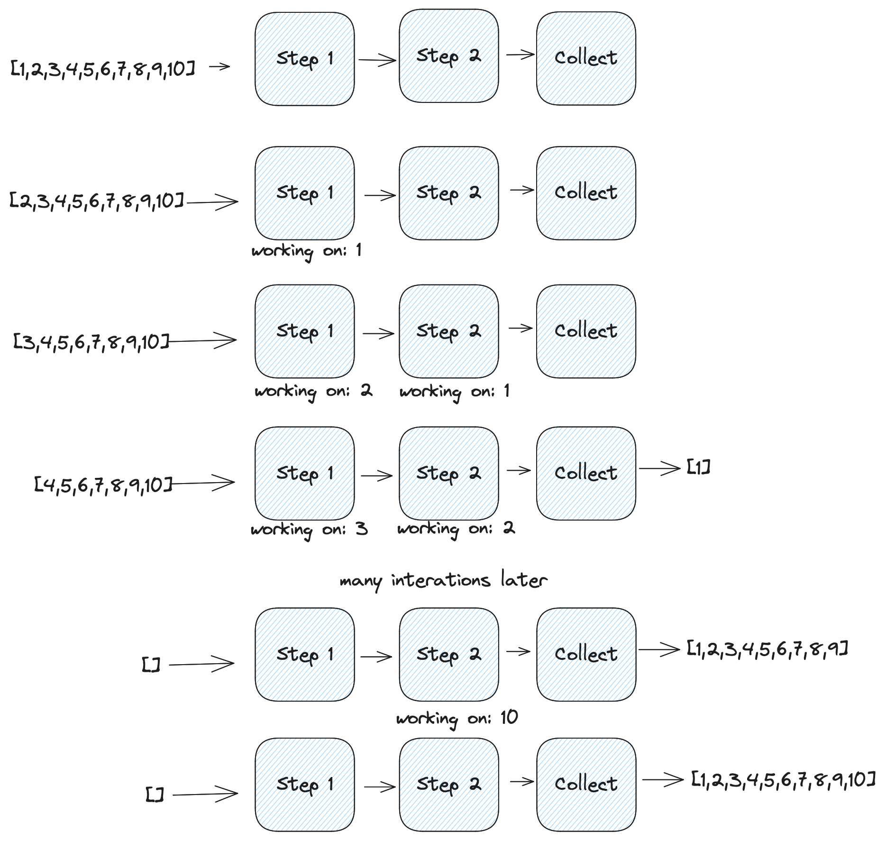
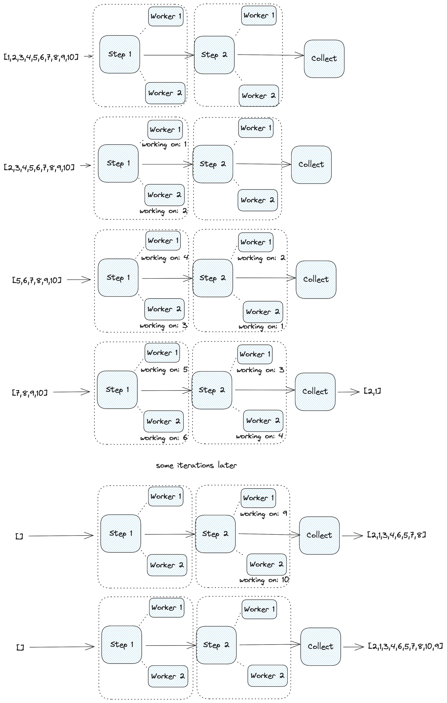

[](https://pkg.go.dev/github.com/dmksnnk/rheos)


# rheos

rheos (from Greek "rheos," meaning a stream or current) is like [lo](https://github.com/samber/lo), but async. 
It provides building blocks for asynchronous stream processing:

- Functional goodies: mapping, filtering, reducing, batching and collecting of stream elements.
- Parallel processing with `ParXXX` 
    (
        [`ParMap`](https://pkg.go.dev/github.com/dmksnnk/rheos#ParMap), 
        [`ParFilter`](https://pkg.go.dev/github.com/dmksnnk/rheos#ParFilter), 
        [`ParFilterMap`](https://pkg.go.dev/github.com/dmksnnk/rheos#ParFilterMap)
    ) functions.
- Cancellation of stream processing on context cancellation or error.
- Support for Go 1.23 iterators: 
    [`FromSeq`](https://pkg.go.dev/github.com/dmksnnk/rheos#FromSeq), [`FromSeq2`](https://pkg.go.dev/github.com/dmksnnk/rheos#FromSeq2), 
    [`All`](https://pkg.go.dev/github.com/dmksnnk/rheos#).


In its core, it is [pipeline pattern](https://go.dev/blog/pipelines) with [lo](https://github.com/samber/lo) and generics.

## Use cases

- API Requests: do N parallel requests and push the data for further processing.
- DB Queries: fetch data from database in one goroutine and process results in another, while executing next query in the first goroutine.
- Batch Event Processing: Handle events in batches, e.g., from RabbitMQ, Kafka or Nats.

## Installation

Only Go 1.18+ is supported.

```bash
go get -u gitlab.heu.group/dmknnk/rheos
````

## How it works

Each "step" runs in a separate goroutine, making each step running asynchronously.
Under the hood it is just [errgroup](https://golang.org/x/sync/errgroup) and a bunch of channels.

<details>
  <summary>Click here for detailed explanation!</summary>

Let's say we have tasks `[1, 2, 3, 4, 5, 6, 7, 8, 9, 10]` that we want to process in 2 steps, each taking 1 second to complete.
With synchronous processing, it will take 10 * 2 * 1s = 20 seconds. With asynchronous processing, it will take around 11 seconds.


```go
start := time.Now()
// our tasks
tasks := rheos.FromSlice(context.Background(), []int{1, 2, 3, 4, 5, 6, 7, 8, 9, 10})
step1 := rheos.Map(tasks, func(_ context.Context, v int) (int, error) {
    time.Sleep(1 * time.Second) // simulate work
    return v, nil
})
step2 := rheos.Map(step1, func(_ context.Context, v int) (int, error) {
    time.Sleep(1 * time.Second) // simulate work
    return v, nil
})
result, err := rheos.Collect(step2)
fmt.Println(result, err)
fmt.Printf("elapsed time: %s\n", time.Since(start).Round(time.Second))
// Output: [1 2 3 4 5 6 7 8 9 10] <nil>
// elapsed time: 11s
```
[Full example](https://play.golang.com/p/CphQm2urcVp).

This is how processing will look like:



Each step processes one task and passes the result to the next one.
At the end we just collect the results - adding all arriving results into a slice.

However, if the order of the items is not important to us, we can process the tasks in parallel, cutting the processing time in half. Let's use parallel steps with 2 workers:


```go
start := time.Now()
// our tasks
tasks := rheos.FromSlice(context.Background(), []int{1, 2, 3, 4, 5, 6, 7, 8, 9, 10})
// parallel mapping with 2 workers
step1 := rheos.ParMap(tasks, 2, func(_ context.Context, v int) (int, error) {
    time.Sleep(1 * time.Second) // simulate work
    return v, nil
})
step2 := rheos.ParMap(step1, 2, func(_ context.Context, v int) (int, error) {
    time.Sleep(1 * time.Second) // simulate work
    return v, nil
})
result, err := rheos.Collect(step2)
fmt.Println(result, err)
fmt.Printf("elapsed time: %s\n", time.Since(start).Round(time.Second))
// Output: [2,1,3,4,6,5,7,8,10,9] <nil>
// elapsed time: 6s
```
[Full example](https://play.golang.com/p/mNZO7NT4LiF).

This is how parallel processing will look:



Each steps has 2 workers, which means each step will process 2 tasks at the same time. The order of the output is undefined, because tasks are passed via channels: the first finished task got passed to the next step as soon as it is finished.

</details>

## Usage


A simple example showing how to map a stream of integers to strings and join them together:

```go
producer := rheos.FromSlice(context.Background(), []int{1, 2, 3, 4, 5})
strings := rheos.Map(producer, func(_ context.Context, v int) (string, error) {
    return strconv.Itoa(v), nil
})
got, err := rheos.Reduce(
    strings,
    func(acc string, s string) (string, error) {
        return acc + s, nil
    },
    "",
)
fmt.Println(got, err)
// Output: 12345 <nil> 
```

Fetching URL asynchronously:

```go
ctx, cancel := context.WithTimeout(context.Background(), 5*time.Second)
defer cancel()
producer := rheos.FromSlice(ctx, []string{
    "https://example.com/1",
    "https://example.com/2",
    "https://example.com/3",
})
responses := rheos.Map(producer, func(ctx context.Context, url string) (*http.Response, error) {
    return http.Get(url)
})
bodies := rheos.Map(responses, func(ctx context.Context, resp *http.Response) ([]byte, error) {
    defer resp.Body.Close()
    return io.ReadAll(resp.Body)
})
err := rheos.ForEach(bodies, func(ctx context.Context, body []byte) error {
    fmt.Println(body)
    return nil
})
if err != nil {
    log.Fatal(err)
}
````

Processing in parallel with workers:

```go
start := time.Now()
tasks := rheos.FromSlice(context.Background(), []int{1, 2, 3, 4, 5, 6, 7, 8, 9, 10})
// parallel mapping with 2 workers
step1 := rheos.ParMap(tasks, 2, func(_ context.Context, v int) (int, error) {
    time.Sleep(1 * time.Second) // simulate work
    return v, nil
})
step2 := rheos.ParMap(step1, 2, func(_ context.Context, v int) (int, error) {
    time.Sleep(1 * time.Second) // simulate work
    return v, nil
})
result, err := rheos.Collect(step2)
fmt.Println(result, err)
fmt.Printf("elapsed time: %s\n", time.Since(start).Round(time.Second))
// Output: [2 1 3 4 6 5 7 8 9 10] <nil>
// elapsed time: 6s
```

### Cancellation

Pipeline cancellation when context is cancelled:

```go
ctx, cancel := context.WithCancel(context.Background())
producer := rheos.FromSlice(ctx, []int{1, 2, 3, 4, 5})
strings := rheos.Map(producer, func(_ context.Context, v int) (string, error) {
    cancel()
    return strconv.Itoa(v), nil
})
got, err := rheos.Collect(strings)
fmt.Println(got, err)
// Output: [] context canceled
```

Pipeline cancellation when error is encountered:

```go
producer := rheos.FromSlice(context.Background(), []int{1, 2, 3, 4, 5})
strings := rheos.Map(producer, func(_ context.Context, v int) (string, error) {
    return "", errors.New("I'm an error")
})
got, err := rheos.Collect(strings)
fmt.Println(got, err)
// Output: [] I'm an error
```

For more examples see [example](example_test.go) or fill free to explore [tests](rheos_test.go). For Go 1.23 examples, see [example_go123](example_go123_test.go) or [iter_test](iter_test.go).
